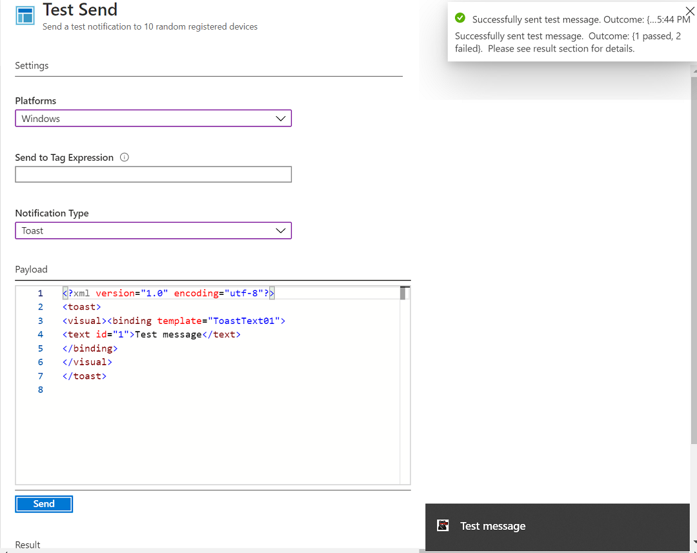
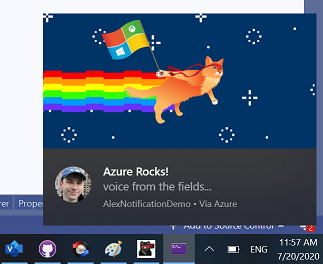

# AZ-204 Demo: Notification Hub

In the demo you will create Notification Hub. Build UWP app and receive the notifications.
Windows 10 and VS 2019 is required.

## Before delivery:

- Visual Studio 2019 required with UWP dev feature.
- [Following guidelines](https://docs.microsoft.com/en-us/azure/notification-hubs/notification-hubs-windows-store-dotnet-get-started-wns-push-notification) will help you setup Azure Environment and test the app.

>NOTE: On the step `Create an app in Windows Store`. UWP application must be updated with parameters in package exactly as recommended in AppManifest.xml:


- Code fo the UWP with schema could be find in "AlexNotificaitonDemo" folder. Load **AlexNotificationDemo\AlexNotificationDemo.sln** project.

- From `App.xaml.cs` update following strings with your values collected on previous step:

```C#

    sealed partial class App : Application
    {
        static string ConnectionString = "<your string>";
        static string HubName = "<your hub name>";
```

- One project in **Sender** folder and modify variables to setup your Azure hub connection in `index.js`


```Javascript

const hubname = '<your hub name>';
const connectionstring = '<your string>';

```


## In Class

1. Run the UWP Application to get successful registration message:


1. From the Azure portal select your Notification hub and run the test. You should select windows and tost notification. The Notification should appears on your host in right bottom corner:




1. From "Sender" folder run command **node .\index.js**. 

1. The notification should arrive and appearers in your right bottom corner.

